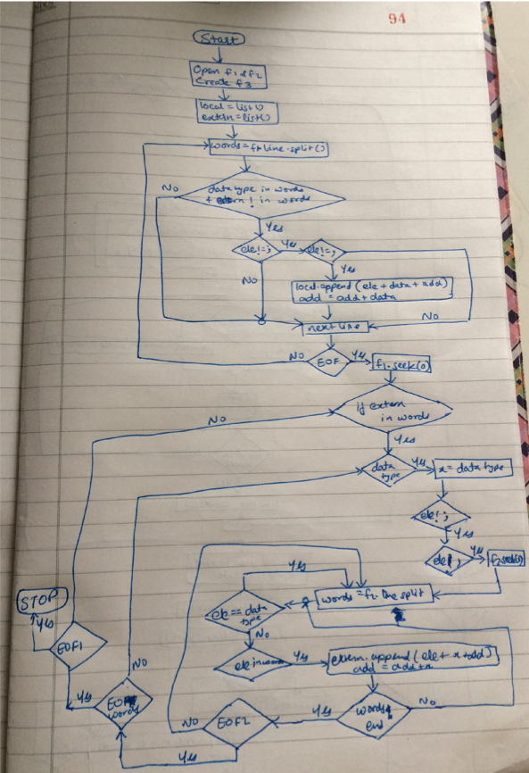
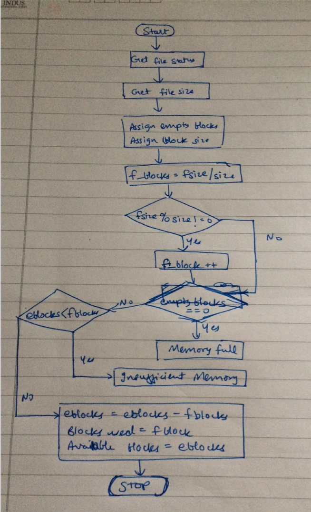

# Simulation-of-Linker-and-Loader-in-Python
This is simple simulation of linker and loader in Python for which I have taken .c file as an input.

## Algorithm for Linker

1. Open files to read and create file to write local and extern parameters.
2. Declare lists local and extern to store local and extern parameters.
3. Read line from file and split it into words.
4. if data type in words & “extern” not in words > if  ele != “;”> if ele != “,” > local.append(ele+data size+address)>address=address+data size>goto 3 until EOF
5. Seek file to 0
6. if “extern” in words > if  ele != “;”> if ele != “,” > if (data type) >x=data type size
7. second_file.seek(0)
8. line in second_file>words=split line
9. if ele1==data_type> continue
10. if ele in words>extern.append(ele+x+address)>address=address+x>break
11. goto 9 until words not end
12. goto 7 until EOF
13. goto 6 until EOF
14. write(local)
15. write(extern)

## Flowchart for Linker

## Algorithm for Loader

1. Import os 
2. Get status of input file
3. Get size of file (fsize)
4. Assign empty blocks and size of one block
5. Blocks in file=fsize / size of one block
6. if fsize%size != 0 > file_block++
7. if empty_blocks==0>print “Memory Full”
8. if empty_blocks less than file_blocks > print “Insufficient Memory”
9. else > empty_blocks=empty_blocks - file_blocks > print ” Blocks used : file_blocks  Available Blocks: empty_blocks”

## Flowchart for Loader

